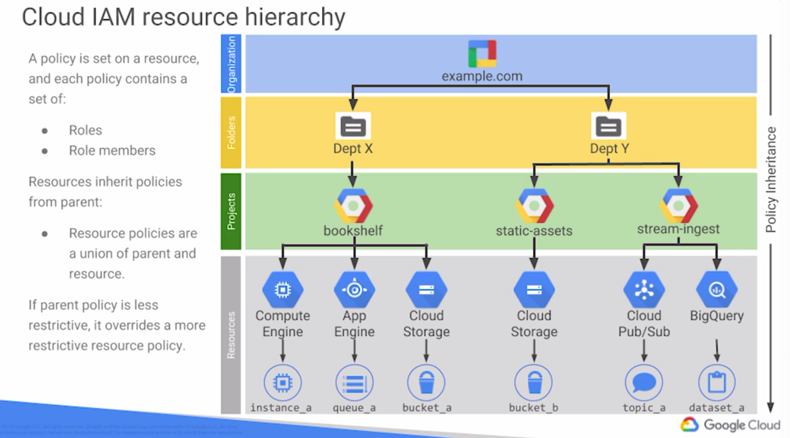
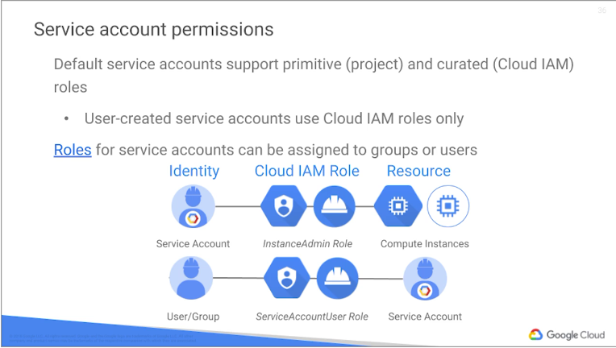

# IAM

# Organization node

- organization is created by Google Sales
- G suite super admins are the only organizational owners
    - can assign organization administrator role from G Suite admin console

## Organization roles

- Organization admin
- Project creator
- Viewer

## Folders

- nested folders

### Roles

- admin
- creator
- viewer

## Projects roles

- creator
- deleter
- viewer
- editor
- owner

# GCP authorization

- manage accounts using G suite
- sync existing creds using Directory Sync
- optionally implement SSO

## built-in features

- session activity tracking
- session management tools
- security alerts
- suspicios activite detection

# IAM hierarchy



Identities:
- google accounts
    - ppl personal accounts
- service accounts
    - named with email address, `project_id@appspot.gserviceaccount.com`, `project_number-compute@developer.gserviceacount.com`
    - google manages keys for computer engine and app negine
    - service account is also resource
        - Alice can have an editor role in a service account and Bob can have the viewer role? WTF
    - app accounts
- google groups
    - collection of ppl and service accounts
- google app domains or cloud identity (example.com)
    - virtual group of all the members in an organization

**Who** _can do what_ `on which resources`

## Permissions

```
<service>.<resource>.<verb>
pubsub.subscriptions.consume
```

Can't assign permissions to users, only to roles

- child policies cannot restrict access granted at the parent level

# Roles

- primitive roles
- curated roles
- custom roles

## Primitive roles

- Owner
- Editor
- Viewer
- Billing administrator

## Curated roles

Groups of permissions

## Custom roles

## Product-specific roles

Compute network admin, App Engine Deployer, etc

# Members

- users
    - google accounts
    - g suite domains
    - google groups
- service accounts
    - identified by an email address
    - user-created (custom)
    - built-in
        - compute engine `%projectnumber-computer@developer.gserviceaccount.com`, editor role on the project
            - by default enabled on all instances created using gcloud or GCP console
        - app engine
    - google APIs service account `%project-number@cloudservices.gserviceaccount.com`, editor role on the projects

# Scopes

Eash service has scopes. Scopes are legacy method, not available for user-created service accounts (use IAM roles instead)



# Service Accounts

- `serviceAccountUser` role, allows grantee to act as service account?
- audit with `serviceAccount.keys.list()` method

## Service accounts and keys

Two types
- GCP managed keys: Google manages keys and key rotation for Compute Engine/App engine, cannot be downloaded
- user-managed keys, private key downloadable

# Cloud IAP

- authn/authz proxy for apps accessed by HTTPS
- cloud IAM policy is applied after authn
