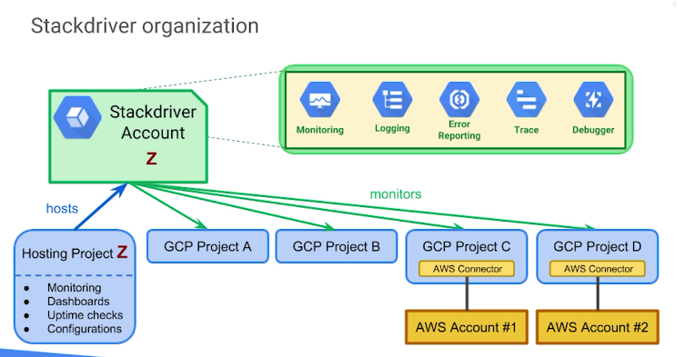
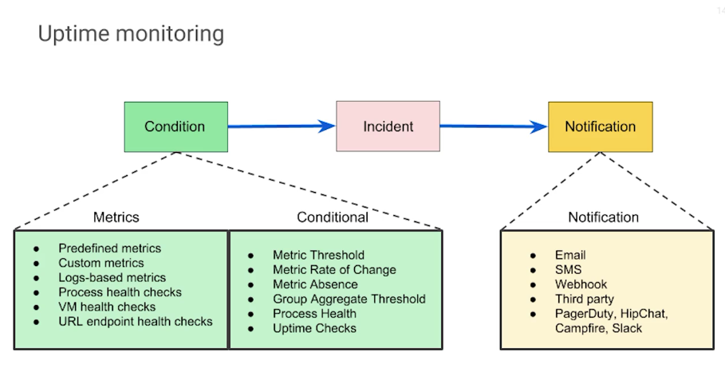

# Stackdriver

- dynamic discovery
- groups (dynamically defined by filters)
- custom metrics supported
- consider using separate stackdriver accounts for data and control isolation

Services:
- Monitoring
- Logging
- Error reporting
- Trace
- Debugger

> To access an AWS account, you must configure a project in GCP to hold the AWS connector and use Stackdrivers premium service here

## Monitoring

- dynamic config and intelligent defaults
- metrics, events, metadata
- alerts
- dashboards/charts

Targets:
- GCP and AWS
- System
    - Hosted probes
    - GCP Linux (native, minimal); Linux/Windows expanded (agent)
- Application instrumentation
- Common apps
    - cassandra, nginx, apache, ES

### Uptime checks

- defaults to verifying from 6 global locations
- global check HTTP(S)/TCP
- app enginge, compute engine, URL, AWS instance/LB

### Monitoring agent

Stackdriver Monitoring can access some metrics **without** the monitoring agent including:
- CPU utilization
- some disk traffic metrics
- network traffic
- uptime information.

Additional metrics via monitoring agent (MA)

MA is supported by:
- computer engine
- EC2 instances

App Engine std/flex supports stackdriver monitoring, GKE not supported

# Logging

Events from GCP and AWS

- API to write logs
- 30-day retention + option to transfer to cloud storage
- log search/view/filter
- log-based metrics
- monitoring alerts can be set on log events
- data can be exported to BigQuery
- logging agent on instances (EC2, Computer Engine, App Engine std/flex, GKE)

## Export

- sinks for export
- stackdriver logs must have access to the resource
    - cloud storage: storage and archiving (logs are batched and set out ~hourly)
    - BQ: analysis
    - pub/sub: software integration

# Error reporting

Stackdriver error reporting counts, analyzes and aggregates the errors in your running cloud services.

App Engine std (beta for flex, compute engine, AWS EC2). Stack trace parser is able to process:
- java
- python
- javascript
- ruby
- C#
- PHP
- Go

# Tracing

Stackdriver Trace is a distributed tracing system that collects latency data from your applications and displays it in the GCP console.

- displays data in near real time
- latency reporting
- per-URL latency sampling
- App Engine/HTTPS LBs/VMs/Apps with the Stackdriver Trace SDKs

# Debugging

- inspect the state of a running application in real-time without stopping or slowing it down
- App Engine/Compute Engine/GKE
