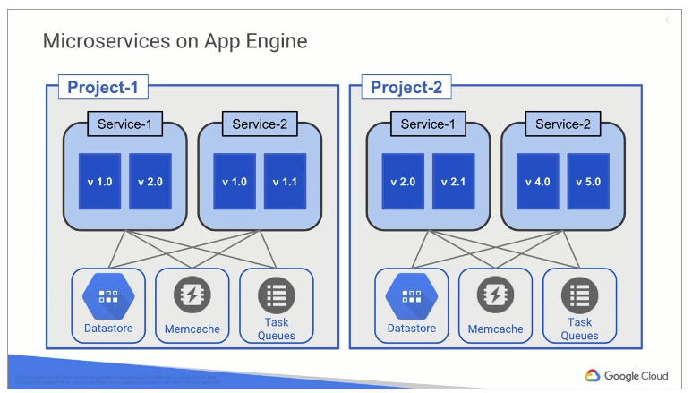
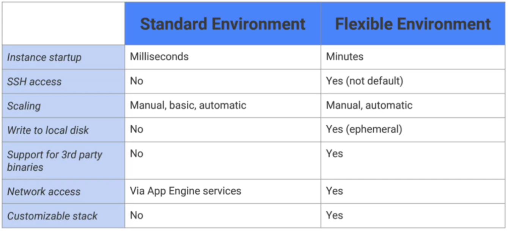

# App Engine ~ Beanstalk?

```
App Engine will scale your application automatically in response to the amount of traffic it receives. That’s why App Engine is especially suited for applications where the workload is highly variable, like a web application. Services are a modular abstraction in app engine, a way to break up the application into separate parts.
```



One of compute options.

- Databases
- Caching
- LB
- logging
- auth
- task queues
- storage
- search
- ...

## Env

### Standard

- java 7
- python 2.7
- go
- php

Sandbox:
- can't write to local file system
- req timeout 60 seconds
- third party binaries aren't allowed

Deploy and test locally -> deploy with SDK -> App engine

### Flexible

Application instances run within Docker containers on Compute Engine virtual machines (VM).

- Java 8
- python 2.7/3.6
- node.js
- ruby
- go
- php
- .NET core
- docker

No sandbox constraints, can connect to instances, uses compute engine VMs,

- 60 minutes request timeout
- no scaling to zero, minimum 1 instance
- write access to ephemeral local disk


