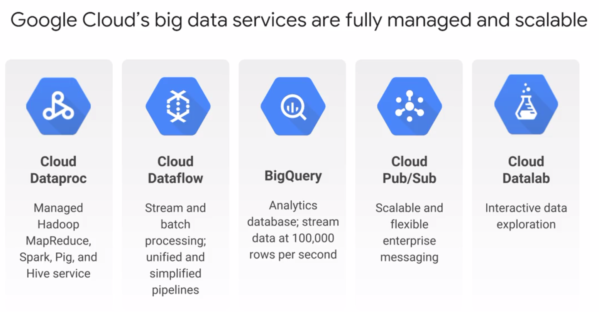

# Big Data services



## Dataproc

Cloud Dataproc is a fast, easy, managed way to run Hadoop, Spark, Hive, and Pig on Google Cloud Platform

`input data --> dataproc --> output data`

- on-demand managed hadoop/spart clusters
- not no-ops
    - must configure cluster
    - not auto-scaling
    - reduces administrative overhead
- integrates with GCP services
- based on apache bigtop distribution
    - hadoop, spark, hive, pig
- HDFS available (but maybe not optimal)
- other ecosystem tools can be installed as well via initialization actions
- 1s billing

## Dataprep

- intelligent data preparation
- trifacta app on back
- fully managed, serverless, web based
- supported file types:
    - input: csv, json (including nested), plain text, excel, log, tsv, avro
    - ouput: csv, json, avro, bigquery table
- `import -> transform -> run dataflow job on transformed dataset -> export results (GCS, BigQuery)`
- IAM:
    - dataprep user: run dataprep in a project
    - dataprep service agent: gives trifecta access to project resources
        - access to GSC buckets, dataflow developer, BigQuery user/data editor
        - necessary for X-project access + GCE service account

[Tips](https://cloud.google.com/blog/products/data-analytics/10-tips-for-building-long-running-clusters-using-cloud-dataproc):
- Use Google Cloud Storage as your primary data source and sink
    - you can’t scale with HDFS because storage is still tied to compute
    - There are still plenty of reasons to use a Cloud Dataproc storage device such as local SSDs, but  the purposes should primarily be limited to ephemeral data such as scratch space, shuffle data, and LLAP cache.
- Persist information on how to build your clusters
    - init actions, which are executables/scripts to install python packages, etc (dataproc runs those on all nodes in the cluster)
    - dataproc custom image
    - cluster config files, export config to yaml file, use file as an input to the import command
        ```
        gcloud beta dataproc clusters import NAME [--async] [--region=REGION] [--source=SOURCE] [GCLOUD_WIDE_FLAG …]
        ````
- Use cloud authentication and authorization policies
    - GCP IAM
        - cluster roles
            - for administration
        - job roles
            - for developers
    - Kerberos

## Cloud dataflow

- apache beam
- processs data using compute engine instances
- automated instance scaling
- data pipelines
- transform-based programming model
- batch and streaming data processing

## Cloud datalab

- built on jupyter
- какая-то хуевина для датасатанистов
- analyze data in bigquery, compute engine, and cloud storage using python, sql, javascript
