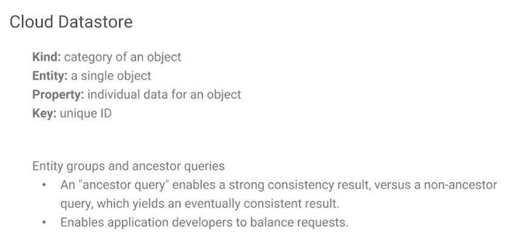

# Cloud Datastore

- schemaless NoSQL DB
- ACID transactions
- strong/eventual consistency
- SQL-like quiries (GQL)
- 1MB/entity max size
- scales from zero to TBs
- multiple locataions
    - multi-regional
    - regional locataions
    - global points of presense

