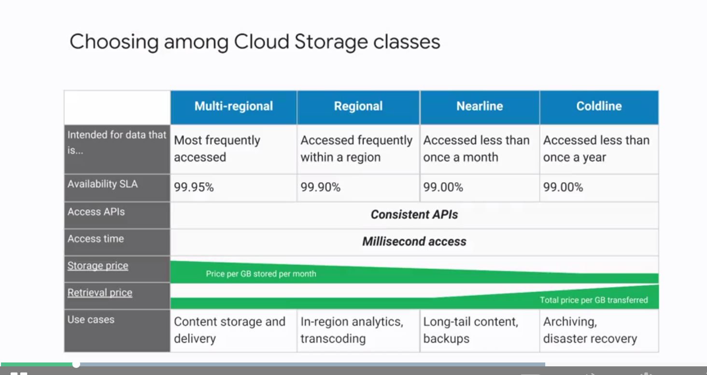
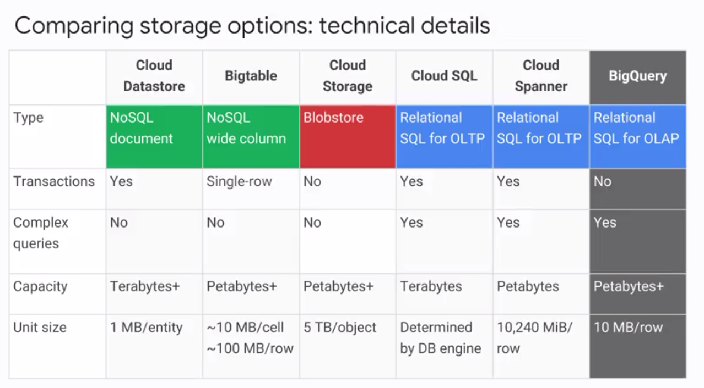
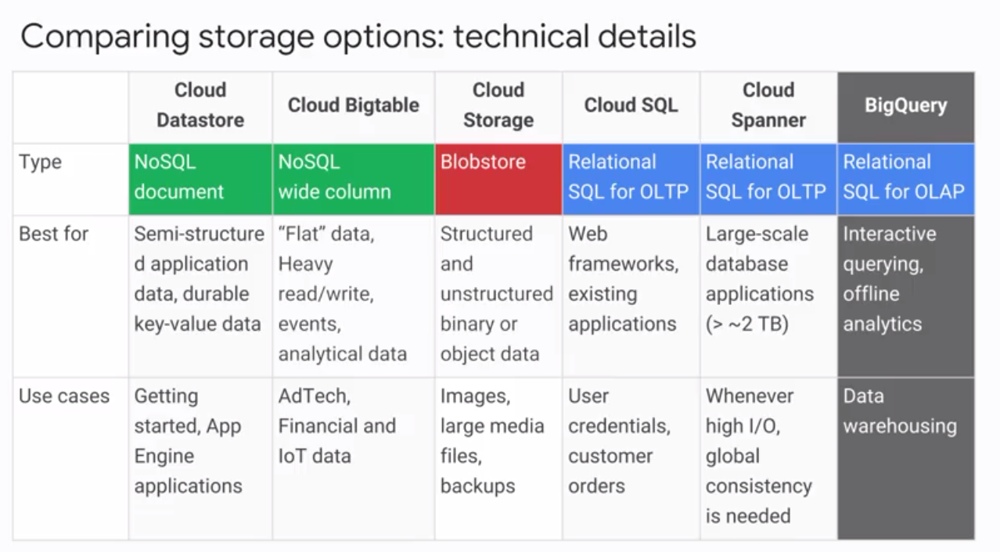

# Cloud Storage

## Cloud storage

**Not a file system!**

- global uniq name for buckets, buckets are regional resources
- no miminum size for objects, 5Tb per object max size
- blob storage
- encrypts data by default at rest and in transit
    - Customer-supplied encryption keys (CSEK)
- immutable objects
- 4 storage classes
    - multi-regional (web site CDN, etc)
        - geo redundant, stores data in at least two geographic locations separated by at least 160km.
        - only on multi-regional locations, such as US, EU, Asia
    - regional
    - nearline
        - access fee per GB of data read ($)
        - 30-day minimum duration
    - coldline
        - archival/DR
        - 90 days min. storage duration
        - costs for data access ($$)
        - higher per operation costs
        - data is available within ms
- simple pricing model
    - ingress, data transfer within a region is free
    - egress costs $$, vary by destination
- lifecycle management policies
    - object inspection occurs in async batches, so rules may not be applied immediately
    - changes to lifecyclt config can take 24 hours to apply
- directory synchronization
    - synchronizes a VM directory with a bucket
- object change notification
    - CS can watch a bucket and send notifications to external apps when objects changes (though a web hook)
    - pub/sub notifications are recommended way
- strong consistency
- versioning (could be disabled/enabled)

### Changing buckets properties

- multi-regional cannot be converted to regional, and vice versa

### Import services

- online transfer
- storage transfer service
    - batch transfers from other region, other cloud providers, from HTTPS endpoints
- transfer appliance (offline, like snowball)
- offline media import (3rd party provider)

### ACLs

- permissions
    - READ/WRITE/FULL_PERMISSIONS
- scope or grantee
    - allUsers
    - allAuthenticatedUsers
    - Google accounts (individuals/groups/domains)
    - Cloud Storage ID
    - Project convenience values
        - owners-[CS project ID]
        - editors-[CS project ID]
        - viewers-[CS project ID]
- each bucket or object ACL can hold up 100 entries
- predefined project roles
    - owner
    - editor
    - viewer
    - storage.admin
    - storage.objectAdmin (storage.objects.*)
    - storage.objectViewer (storage.objects.get, storage.objects.list)
    - storage.objectCreator (storage.object.create)

### Signed URLs

- ticket is cryptosigned URL
- TTL
- operations specified in ticket

`gsutil signurl -d 10m path/to/privatekey.p12 gs://bucket/object`

### Consistency

strong consistency for everything \o/

- read-after-write
- read-after-metadata-update
- read-after-delete
- bucket listing
- object listing
- granting access to resources

## Cloud Big Table

Fully managed NoSQL, wide-column DB for terabyte apps

- petabyte scale with very low latency
- accessed using HBase API
- native compatibility with big data, Hadoop ecosystems
- in flight/at rest encryption
- same DB used in maps/gmail/etc
- single-row transactions
- 10Mb/cell, 100Mb/row max size

> The table is composed of rows, each of which typically describes a single entity, and columns, which contain individual values for each row.
> Each row is indexed by a single row key and columns that are related to one another are typically grouped together into a column family.

Data ingestion:
- Application API
- Streaming: Spark/Dataflow streaming/Storm
- Batch processing: Hadoop MapRecude, Dataflow, Spark

## CLoud SQL / amanged RDBMS

- MySQL
- PostgreSQL

Features:
- automatic replication and failover
- vertical/horizontal scaling (via read replicas)

Clients:
- `gcloud beta sql`
- App Engine, G Suite scripts
- Applications and tools
    - SQL workbench, toad
    - external apps using standrad drivers

2 generations:
- 1st gen MySQL 5.5, max 16Gb RAM, 500Gb disk, IPv6, on-demand activation policy
- 2nd gen, 7x throughpujt and 20x storage capacity of 1st gen, 208 Gb RAM, 10TB storage, MySQL  5.6/5.7, InnoDB only

### Cloud SQL Proxy

The Cloud SQL Proxy provides secure access to your Cloud SQL second generation instances without having to whitelist IP addresses or configure SSL. Cloud SQL Proxy works by having a local client called eth-proxy running the local environment.

## Cloud Spanner

Cloud Spanner can scale to petabyte database sizes, while Cloud SQL is limited by the size of the database instances you choose.

- strong transactional global consistency
    - strongly consistent secondary indexes
- schemas
- automatic synchronous replication for HA
- SQL queries ANSI 2011 with extensions
    - ALTER statements for schema changes
- 10G/row max size

