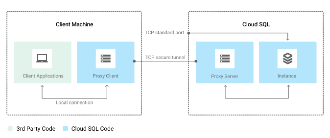

# Cloud Storage

## Cloud storage

**Not a file system!**

- global uniq name for buckets, buckets are regional resources
- no miminum size for objects, 5Tb per object max size
- blob storage
- encrypts data by default at rest and in transit
    - Customer-supplied encryption keys (CSEK)
        - config in `.boto` file
            ```
            [GSUtil]
            encryption_key = ...
            decryption_key1 = ...
            decryption_key2 = ...
            ```
- immutable objects
- 4 storage classes
    - multi-regional (web site CDN, etc)
        - geo redundant, stores data in at least two geographic locations separated by at least 160km.
        - only on multi-regional locations, such as US, EU, Asia
    - regional
    - nearline
        - access fee per GB of data read ($)
        - 30-day minimum duration
    - coldline
        - archival/DR
        - 90 days min. storage duration
        - costs for data access ($$)
        - higher per operation costs
        - data is available within ms
- simple pricing model
    - ingress, data transfer within a region is free
    - egress costs $$, vary by destination
- lifecycle management policies
    - object inspection occurs in async batches, so rules may not be applied immediately
    - changes to lifecyclt config can take 24 hours to apply
- directory synchronization
    - synchronizes a VM directory with a bucket
- object change notification
    - CS can watch a bucket and send notifications to external apps when objects changes (though a web hook)
    - pub/sub notifications are recommended way
- strong consistency
- versioning (could be disabled/enabled)

### Changing buckets properties

- multi-regional cannot be converted to regional, and vice versa


### Import services

- online transfer
- storage transfer service
    - batch transfers from other region, other cloud providers, from HTTPS endpoints
    - one-time transfer operations
    - deleting existing objects in the dest bucket if they don't have a corresponding object in the source
    - schedule **periodic sync** with advanced filters
- transfer appliance (offline, like snowball)
- offline media import (3rd party provider)

### ACLs

- permissions
    - READ/WRITE/FULL_PERMISSIONS
- scope or grantee
    - allUsers
    - allAuthenticatedUsers
    - Google accounts (individuals/groups/domains)
    - Cloud Storage ID
    - Project convenience values
        - owners-[CS project ID]
        - editors-[CS project ID]
        - viewers-[CS project ID]
- each bucket or object ACL can hold up 100 entries
- predefined project roles
    - owner
    - editor
    - viewer
    - storage.admin
    - storage.objectAdmin (storage.objects.*)
    - storage.objectViewer (storage.objects.get, storage.objects.list)
    - storage.objectCreator (storage.object.create)

### Signed URLs

- ticket is cryptosigned URL
- TTL
- operations specified in ticket

`gsutil signurl -d 10m path/to/privatekey.p12 gs://bucket/object`

### Consistency

strong:
- read-after-write
- read-after-metadata-update
- read-after-delete
- bucket listing
- object listing
- granting access to resources

eventual:
- revoking access (~1m)
- enabling object versioninig in a bucket, wait ~30 sec before write/overwrite

## CLoud SQL / managed RDBMS

- MySQL
- PostgreSQL

Features:
- automatic replication and failover
    - MySQL 2nd, semisync repl for failover, async for read replicas
- vertical/horizontal scaling (via read replicas)

Backups:
- MySQL 1st gen instances: Storage of the most recent 7 backups is included in the cost of your instance
- MySQL 2nd gen instances: The most recent 7 automated backups, and all on-demand backups, are retained.
- PostgreSQL instances: The most recent 7 automated backups, and all on-demand backups, are retained

Clients:
- `gcloud beta sql`
- App Engine, G Suite scripts
- Applications and tools
    - SQL workbench, toad
    - external apps using standrad drivers

2 generations:
- 1st gen MySQL 5.5, max 16Gb RAM, **500Gb disk**, IPv6, on-demand activation policy
- 2nd gen, 7x throughpujt and 20x storage capacity of 1st gen, 208 Gb RAM, **10TB storage**, MySQL  5.6/5.7, InnoDB only

Fixed limits:
- connection limits
    - MySQL 2nd gen
        - db-f1-micro: 250
        - db-g1-small: 1k
        - All other machine types: 4k
    - PG
        - 25-1k
- storage limits
    - MySQL 1st gen: 250Gb (could be increased to 500Gb)
    - 2nd gen: up to 30720 Gb
    - PG: up to 30720 Gb

### Failover

- The failover replica must be in the same region as the primary instance, but in a different zone.
- You can create only one failover replica for every primary instance.
- You cannot change the failover replica's activation policy or maintenance window. Failover replicas have the same maintenance window as the primary instance.
- You cannot enable backups on the failover replica. Backups must be performed on the primary instance.
- You can create a failover replica only from the primary instance, not from read replicas.

Fun:
- In order to minimize the amount you are charged for instances on per-use billing plans, by default your instance becomes passive if it is not accessed for 15 minutes (1st gen)
- Instances running MySQL 5.5 have the `innodb_file_per_table` flag set to **OFF** by default; InnoDB never shrinks its default tablespace
- Cloud SQL does not support SUPER privileges, which means that GRANT ALL PRIVILEGES statements will not work
- Per-use and package pricing options are applicable only for First Generation instances. As a rule of thumb, it is more economical to opt for the package plan if your instance is used for more than 450 hours each month. You can change the billing plan for your instance up to 3 times per month
- RO on full disk, disk cloud be expanded on 2nd gen, but not on 1st?
- PostgreSQL and MySQL Second Generation instances that are suspended for 90 days are deleted. This applies to instances with a state of `SUSPENDED`. Instances that are stopped, with a state of `RUNNABLE`, are not deleted.

### Cloud SQL Proxy

The Cloud SQL Proxy provides secure access to your Cloud SQL second generation instances without having to whitelist IP addresses or configure SSL.
Cloud SQL Proxy works by having a local client running the local environment.
Your application communicates with the proxy with the standard database protocol used by your database.
The proxy uses a secure tunnel to communicate with its companion process running on the server.



## Cloud Spanner

Cloud Spanner can scale to petabyte database sizes, while Cloud SQL is limited by the size of the database instances you choose.

- strong transactional global consistency
    - strongly consistent secondary indexes
- schemas
- automatic synchronous replication for HA
- SQL queries ANSI 2011 with extensions
    - ALTER statements for schema changes
- 10G/row max size


