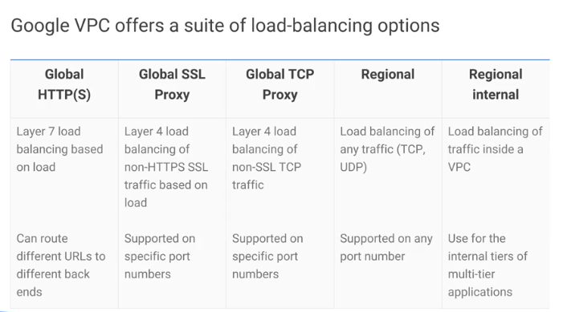

# Compute engine

- custom VMs

## Preemptible VMs

- per-hour price of preemptible VMs incorporates a substantial discount.

## Persistance storage

- standard
- SSD
    - local SSDs

# Instance groups

- Allows to manage groups of compute engine instances
- simple mgmt tasks:
    - monitor CPU, disk, network IO across the group
    - reboot all instances in the group

## Types

- managed groups
    - use template to define properties for every instance in the group
    - deployes identical instances based on **instance template**
    - group can be resized
    - manager ensures all instances are in running state
    - typically used with an autoscaler
- unmanaged groups
    - collection of instances not necessarily identical

## Autoscaling

- in a managed instance group
- reduce costs by shutting down extra instances
- create one autoscaler per managedd instance group
- autoscalers can be used with zone-based or regioanal managed instance groups

### policices

- CPU
    - threshold for group avg CPU usage
- http reqs per seconds/instances
    - LB specifies max req per seconds
- stackdriver metrics
    - gauge
    - delta/min
    - delta/second
- multiple metrics options
    - up to 5 policies based on those three metric options
    - autoscaler selects policy with most amount of available servers

## Load balancing

### Network

- TCP
- UDP
- HTTP(S)
- SSL

allows packet inspection, point to target pool if instances in region

forwarding rules:
- to pools
- to target instances
- optional health checks
- session affinity
- auto scaling

### HTTP

- distributes traffic among groups of instances based on
    - proximity to the user
    - request URL

requires instance groups (managed/unmanaged)
- session affinity
- auto scaling
- connection draining

# TODO
- create instance group with autoscaler
- network/http load balancer

# Links

- https://cloud.google.com/compute/docs/vpc/
- https://cloud.google.com/compute/docs/
