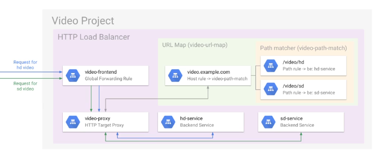

# Compute engine

## Pricing

- 1 minute minimum, per-second billing, sustained use discounts
- preemtible instances (up to 80% discount)
- custom machine types
- recommendation engine
- commited use discounts
- usage of VMs of the same machine type in the same zone is combined as if they were one machine (inferred instances)
- no charge for stopped VM (still chardeg for attached disks and IPs)

## Lifecycle


## Machine types

- high CPU/MEM
- standard
- shared-core

---
features:
- vCPU == 1 hyperthreaded core
- 2 vCPU == 1 physical core
- network scales at 2 Gbit/s for each CPU core up to a max 16 GB/s (8 vCPUs)

## Preemptible VMs

- Live at most 24 hours
- no charge if terminated in the first 10 minutes
- can be pre-empted with a 30-second notification via API
- up to 80% discount
- no live migrate, no auto restart

## Persistance storage

- standard (up to 64 Tb per instance)
- SSD (up to 64 Tb per instance)
- local SSDs (max 3Tb per instance, 8 partitions x 375 Gb)
- can be attached in read-only mode to multiple VMs
- checksums built-in, automatic encryption


### Local SSD disks

- not available on shared core
- up to 8 local disks, 375Gb each == 3TB
- data survives a reset, but not a VM stop or terminate (cannot be reattached to a different VM)
- can use your own encryption keys

### Snapshots

- not available for local SSDs
- incremental backup to cloud storage
- snapshots can be restored to a new persistent disk
- snapshots are global resources, could be use to create a boot disk in any region, in any network
- egress charges applies if image is created in another region?

## Availability policies

- live migration (default)
- terminate + automatic restart (default, could be disabled)

## Images

- custom images could be shared between projects
- compute engine could import image from local vm/virtualbox/packer/another cloud
- upload to cloud storage -> import to custom images
- share betweeb projects using IAM roles: `--image-project` tag
    - `gcloud compute instances create test-instance --image database-image-a --image-project database-images`
- export to cloud storage bucket as tar file: `gcimagebundle`
- image family point at latest version of an image

## Metadata

- project vs vm metadata
- kv pairs, can contain directories, can return specific value for a key, all keys in a directory, on a recursive list of keys
- http://metadata.google.internal/computeMetadata/v1
- http://<ip-address>/computeMetadata/v1/
- project: `gcloud compute project-info describe`
- instance: `gcloud compute instances describe <instance>`
- `wait_for_change`: `curl -H ""Metadata-Flavor: Google" http://metadata.google.internal/computeMetadata/v1/instance/tags?wait_for_change=true`
- `timeout_sec` - returns if value changed after n seconds
- ETags?

### maintenance events

- `/scheduling` directory
- `maintenance-event` attribute
- notifies when a maintenance event is about to occur
- value changes 60 seconds before a transparent maintenance events starts
- query periodically to trigger app code priot to a transparent maintenance event (backup/logging/save state)

### metadata tags ?

- boot: startup-script-url=%URL%
- run:
- maintenance:
- shutdown: shutdown-script-url=%URL%

# Instance groups

- Allows to manage groups of compute engine instances
- simple mgmt tasks:
    - monitor CPU, disk, network IO across the group
    - reboot all instances in the group

## Types

- managed groups
    - use template to define properties for every instance in the group
    - deployes identical instances based on **instance template**
    - manager ensures all instances are in running state
    - typically used with an autoscaler
    - can be single zone or regional
        - regional groups supports autoscaling, NLB and HTTPS LBs
- unmanaged groups
    - collection of instances not necessarily identical

## Health Checks

Supported protocols:
- HTTP(S)
- TCP
- SSL (TLS)

## Autoscaling

- in a managed instance group
- reduce costs by shutting down extra instances
- create one autoscaler per managed instance group
- autoscalers can be used with zone-based or regioanal managed instance groups
- can't have conflicting rule sets

### policices

#### per-instance metrics

- CPU
    - threshold for group avg CPU usage
- http reqs per seconds/instances
    - LB specifies max req per seconds
- stackdriver metrics
    - target types:
        - `GAUGE`: The autoscaler computes the average value of the data collected in last couple minutes and compares that to the target utilization value of the autoscaler.
        - `DELTA_PER_MINUTE`: The autoscaler calculates the average rate of growth per minute and compares that to the target utilization.
        - `DELTA_PER_SECOND`: The autoscaler calculates the average rate of growth per second and compares that to the target utilization.
    - when using instance specific metric -> can't scale to 0, as at least one instance must report metric.
    - the metric must export data at least every 60 seconds
    - the metric must export int64 or double data values.
- multiple metrics options
    - up to 5 policies based on those three metric options
    - autoscaler selects policy with most amount of available servers

#### per-group metrics

Per-group metrics allow autoscaling with a standard or custom metric that does not export per-instance utilization data. Instead, the group scales based on a value that applies to the whole group and corresponds to how much work is available for the group or how busy the group is.

```
⚠️ Note: Regional managed instance groups do not support autoscaling using per-group metrics.
```

Instance provisioning relative to metric:
- Instance assignment: Scale the size of MIGs based on the number of unacknowledged messages in a Google Pub/Sub subscription or a total QPS rate of a network endpoint.
- Utilization target: Scale the size of MIGs based on a utilization target for a custom metric that does not come from the standard per-instance CPU or memory use metrics. For example, you might scale the group based on a custom latency metric.

❗️ When you configure autoscaling with per-group metrics and you specify an instance assignment, your instance groups can scale down to 0 instances.

## Load balancing


- no pre-warming required

### Network

- TCP
- UDP
- HTTP(S)
- SSL

allows packet inspection, point to target pool if instances in region

forwarding rules:
- to pools
- to target instances
- optional health checks
- session affinity
- auto scaling

### HTTP(S)


- distributes traffic among groups of instances based on
    - proximity to the user
    - request URL
- HTTP LB on ports 80/8080, HTTPS only 443
- max 10 SSL certificates per target proxy
- min TLS 1.0 is supported

requires instance groups (managed/unmanaged)
- session affinity
- auto scaling
- connection draining

#### Session affinity

GCLB cookie

#### URL Maps

URL Maps are called HOst and path rules in console

#### Traffic allocation

- nearest first with available capaciy
- next closest regoin with capacity
- requests to a given region are distributed evenly across backend services



### NLBs

- regional non-proxied LB
- pass-through LB
- UDP/TCP/SSL
- only `httpHealthChecks`

### Target pools

- only with forwarding rules for TCP/UDP traffic
- up to 50 target pools per project
- only one health check per pool
- VMs can be in different zones in the same region

# Links

- https://cloud.google.com/compute/docs/vpc/
- https://cloud.google.com/compute/docs/
