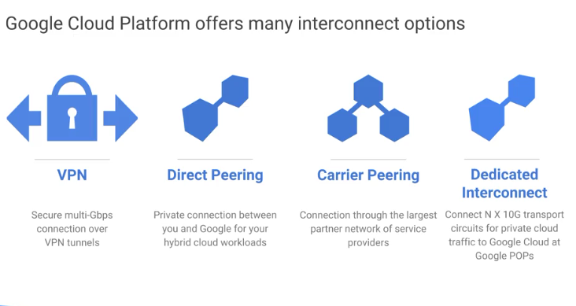
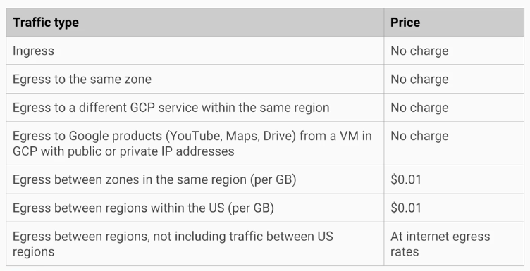

# Networking

- VPC networks have global scope, subnets can span the zones that make up a region.
- you can have resources in different zones on the same subnet
- you can dynamically increase the size of a subnet in a custom network by expanding the range of IP addresses allocated to it, without affecting already configured VMs.

## Network

- max 5 per project
- Has no IP address range
- is global and spans all available regions
- contains subnetworks
    - subnet can extend across zones in the same region
    - single firewall rule can apply to both VMs even though tehy are in different zones
    - two VMs could be on the same subnet but in differente zones
    - first address is reserved for router
- can be of type:
    - default
    - auto mode
    - custom mode
- each VPC network functions as a distributed firewall, both ingress/egress
- implied ingress deny all and egress allow all

fw rule:
`direction | src/dst | proto | port | action | priority | rule assigment`

ingress: CIDR/Proto/ports/SourceTags on instances

You can convert auto mode network to custom mode network, but "once custom, always custom"

## IP addresses

### Internal IP

- allocated from subnet range to Vms by DHCP
- lease renewed every 24 hours
- VM name + IP is registered with network-scoped DNS
- `hostname.c.%project_id%.internal`
- internal DNS resolver provided as part of compute engine (`169.254.169.254`, metadata server)
- It is possible to have VMs with duplicate Internal IP addresses in the two networks

### External IP

- optional
- ephemeral / reserved external IP (static), costs $$ when not attached to a running VM
- unknown to the OS of the VM
- no public DNS by default
- DNS zones can be hosted using Cloud DNS

### Alias IP ranges

- secondary CIDR range, allocated to the same NIC?

## Routing

- every network has routes
- default route to outside network
- default network has preconfigured firewall rules that allow all instances on the network to talk with each other
- no such rules for manually created networks
---
- Each route in the route's collection may apply to one or more instances.
- A route applies to an instance, if the network and instance tags match.
- If the network matches and there are no instance tags specified, the route applies to all instances in that network.

## VPC

- built-in route tables
- global distributed firewall
- shared VPCs
- VPC peering

### VPNs and stuff

- cloud router (BGP) for VPN connections
- direct peering with Google (shared DC in AWS terms?)
- private dedicated interconnect (DC in AWS?)

#### Google Cloud VPN

- site-to-site IPSec VPN
- ESP in tunnel mode with auth
- routing
    - static
    - dynamic (cloud router)
- IKEv1/IKEv2 using a shared secret

#### Cloud Router

- provides BGP routing
- graceful restart/ECMP
- primary/backup tunnels for failover
    - MED
    - AS path length
    - AS prepend

#### Cloud interconnect (direct connect in AWS)

- connect on-premise private networks with gcloud
- cannot connect to public services via the same connection (LACP max 8x10Gbits/s connections, min 10Gbit/s)
- connection is not encrypted, cloud VPN not available
- CDN interconnect (?)
- Cloud interconnect vs direct peering (?)

#### External peering

##### Direct peering

- BGP peering between your AS in Google's via edge point of presense (PoP)
- For all Google-bound traffic, not limited to GCP
- /24 min prefixes
- DP set up with Google NetOps Content Distribution (NCD) team (outside of GCP team)

##### Carrier peering

BGP peering is set up between service provider and google.

##### External peering

###### Shared VPC

share GCP VPN networks across projects in cloud organization

- VMs, VPNs, firewall rules in shared network spaces
- two shared VPC networks could be peered

## Billing

## Removing networks

- Delete VMs
- Delete fw rules
- (delete subnetworks) delete network
